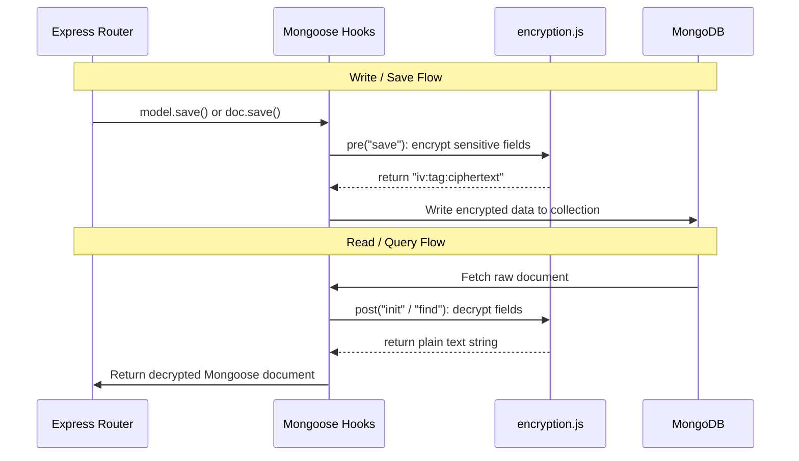

# MediConnect Security & Audit Architecture

This document describes the security controls, design decisions, and implementation details for authentication, authorization, PHI data encryption, and audit logging within the MediConnect platform.

---

## 1. Authentication & Role-Based Access Control (RBAC)

MediConnect uses JSON Web Tokens (JWT) for secure, stateless user session management combined with a role-based access control (RBAC) layer.

### Authentication Flow
1. **Login & Registration**: Users register or authenticate through public API endpoints (`/api/auth/register`, `/api/auth/login`). Upon successful credentials validation, the server signs a JWT payload containing the user's database `_id` and their associated `role` (using `process.env.JWT_SECRET`).
2. **Token Verification**: Protected endpoints require the client to supply this token via the `Authorization: Bearer <token>` header.
3. **Auth Middleware**: The [auth.js](file:///c:/Users/HP/OneDrive/Desktop/New%20Project/MediConnect/server/src/middleware/auth.js) middleware intercepts incoming requests, verifies and decodes the JWT, queries the `User` document (excluding the password field), and attaches it to `req.user`.

### Authorization & RBAC
Endpoints restricting access by role utilize the [role.js](file:///c:/Users/HP/OneDrive/Desktop/New%20Project/MediConnect/server/src/middleware/role.js) authorize middleware:
* Roles supported: `Patient`, `Doctor`, and `Admin`.
* Example: `router.post("/", auth, authorize("Doctor"), ...)` enforces that only users with the `Doctor` role can invoke that route.

---

## 2. Protected Health Information (PHI) Encryption

To satisfy HIPAA and general healthcare privacy regulations, all sensitive Protected Health Information (PHI) stored in MongoDB must be encrypted at rest.

### Cryptographic Configuration
* **Algorithm**: `aes-256-gcm` (Advanced Encryption Standard in Galois/Counter Mode).
* **Initialization Vector (IV)**: A cryptographically secure random 12-byte IV is generated per-field write.
* **Authentication Tag**: GCM generates a 16-byte authentication tag to verify data integrity and prevent tampering.
* **Key Derivation**: The raw `process.env.ENCRYPTION_KEY` is derived into a secure 32-byte key via SHA-256 hashing.
* **Storage Format**: Encrypted values are stored in the database in a formatted string: `ivHex:tagHex:cipherHex`.

### Automated Lifecycle Integration
Encryption and decryption are abstracted away from route handlers using Mongoose middleware hooks in:
* [Patient.js](file:///c:/Users/HP/OneDrive/Desktop/New%20Project/MediConnect/server/src/models/Patient.js)
* [Medicalrecord.js](file:///c:/Users/HP/OneDrive/Desktop/New%20Project/MediConnect/server/src/models/Medicalrecord.js)
* [Prescription.js](file:///c:/Users/HP/OneDrive/Desktop/New%20Project/MediConnect/server/src/models/Prescription.js)

---

## 3. Security Audit Logging

All access to APIs, modifications of records, and security-relevant actions are tracked in a dedicated audit collection.

### Database Representation
Logs are stored in the `AuditLog` collection, defined by the [AuditLog.js](file:///c:/Users/HP/OneDrive/Desktop/New%20Project/MediConnect/server/src/models/AuditLog.js) schema:
* `timestamp`: Precise date and time when the request was initiated.
* `userId`: Reference to the authenticated `User` ID (resolves to `null` if the request is unauthenticated at start).
* `ipAddress`: Originating IP of the caller (supports proxy-forwarded IPs).
* `apiEndpoint`: The original URL path invoked (e.g. `/api/records/patient/6a325087ff6173c9298c25dc`).
* `performedAction`: A standardized, human-friendly translation of the action performed.
* `method`: HTTP Verb (`GET`, `POST`, `PUT`, `DELETE`).
* `statusCode`: HTTP status code returned to the client (to record success/failure outcomes).

### Non-blocking Middleware Pipeline
The [audit.js](file:///c:/Users/HP/OneDrive/Desktop/New%20Project/MediConnect/server/src/middleware/audit.js) middleware executes on every request:
1. Records the start timestamp.
2. Continues request execution immediately via `next()`.
3. Registers an event listener on the response `finish` event (`res.on("finish", ...)`).
4. When the response finishes sending:
   * It extracts the late-bound user ID (populated either by the authentication middleware `req.user` or by route controllers `req.auditUserId` for login/registration actions).
   * Reconstructs the matched Express route pattern by joining `req.baseUrl` and `req.route.path` (e.g., `/api/records/patient/:patientId`) to map to a static, standardized performed action descriptor.
   * Saves the `AuditLog` entry asynchronously, preventing database I/O latency from delaying responses to users.

### Action Mapping Table

| HTTP Method | Route Template | Performed Action Description |
| :--- | :--- | :--- |
| `POST` | `/api/auth/register` | User Registration |
| `POST` | `/api/auth/login` | User Login |
| `GET` | `/api/auth/me` | Retrieve Current User Profile |
| `GET` | `/api/protected/patient` | Access Protected Patient Route |
| `GET` | `/api/protected/doctor` | Access Protected Doctor Route |
| `GET` | `/api/protected/admin` | Access Protected Admin Route |
| `GET` | `/api/protected/staff` | Access Protected Staff Route |
| `GET` | `/api/patients/me` | Retrieve Own Patient Profile |
| `PUT` | `/api/patients/me` | Update Own Patient Profile |
| `GET` | `/api/patients/:id` | Retrieve Patient Profile By ID |
| `POST` | `/api/records` | Create Medical Record and Prescription |
| `GET` | `/api/records/patient/:patientId` | Retrieve Patient Medical Records |
| `GET` | `/api/records/:id` | Retrieve Medical Record Details |

If a route is not predefined in the mapping, it falls back to logging the generic HTTP method and endpoint (e.g., `GET /api/nonexistent-route`).
